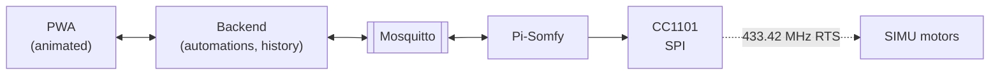

# somfy-shutters


# 🚧 WORK IN PROGRESS 🚧

> **It runs, but it has never moved a real shutter.** Features 001–006 and 008 are
> implemented and tested against a simulated house; the MQTT path speaks Pi-Somfy's
> current interface and has been walked against a real Mosquitto broker impersonating
> Pi-Somfy — but no motor in this project has been paired yet, so it is unproven on
> hardware.
>
> Clone it to read it or to try the simulator. Do not put it in front of your windows
> and expect it to be right yet.

---

Self-hosted control for SIMU/Somfy RTS roller shutters through
[Pi-Somfy](https://github.com/Nickduino/Pi-Somfy): a live animated view of where every
shutter stands, and automations that run on the house's own network.

## What works today

| | |
|---|---|
| ✅ | Open, close, stop and drive to a position, on one shutter or all of them |
| ✅ | Animation at the shutter's real travel speed, starting the moment you tap |
| ✅ | Every position states whether it is certain, estimated or unknown, and how old that is |
| ✅ | Live updates to every open client; reconnect with backoff after any interruption, and no animation carries on while disconnected |
| ✅ | A simulated house with soft start and non-linear travel, so it develops without hardware |
| ✅ | Guided travel-time calibration: two presses per trip, median over runs, per direction |
| ✅ | One-tap confirmation after an ordinary trip, so the times stay true without a wizard |
| ✅ | A midpoint check per direction: one drive, one answer, and it never moves the end points |
| ✅ | "Drive to 50 %" lands at 50 %: the travel curve converts commands, not just the animation |
| ✅ | A shutter under measurement says so everywhere and refuses commands — "Alle zu" included |
| ✅ | Buttons that would do nothing are disabled: *auf* when open, *zu* when closed, *stop* when idle |
| ✅ | Automations on a clock time or at sunrise/sunset ± offset, with a "not before / not after" window |
| ✅ | Every firing recorded per shutter; nothing queued; held while the Pi's clock cannot be trusted |
| ✅ | Pause all automations, or skip one rule's next firing; deleting a rule asks first |
| ✅ | Groups — rooms, floors, a side of the house — that overlap, move with one tap, and serve as rule targets |
| ✅ | Installable as an app; opens without the backend and says positions are not current; updates reach every phone |
| ✅ | Speaks Pi-Somfy's current MQTT interface (v3.1+): explicit stop, the bridge's own availability, retained reports treated as old news |
| ✅ | Shutters come from Pi-Somfy's own announcements: nobody copies an address; new ones wait for a name before they join anything |
| ✅ | A guide for adding a window — with or without a working remote — that notices the new shutter by itself |
| ✅ | Removing a shutter names what goes with it, cleans groups and rules, and sends nothing to the bridge |
| ✅ | A shutter deleted in Pi-Somfy is marked "vergessen" after its next restart, and takes no more commands |
| ✅ | Nothing moves without a credential: every phone pairs once with a six-character code, and each can be revoked alone |
| ✅ | A credential may do less than everything — watch, drive, configure, calibrate, manage devices |
| ✅ | A record of who moved what, including rules and movements the app only observed; guessing and flooding are throttled |
| ⬜ | Anything confirmed on a real motor |

791 backend and 84 frontend tests, against the real API surface, the tracker's rules,
the calibration arithmetic, and the simulated house end to end.

## The problem this project takes seriously

Somfy RTS is **one-way radio**. The motor has no transmitter: it never reports its
position, never acknowledges a command, and cannot be queried. The only certain
positions are the two mechanical end stops, because the motor physically stops there.

Everything in between is dead reckoning — a known start, a sent command, and elapsed
time. So this app does not pretend to read the shutter. It shows how confident it is:

| State | Meaning |
|---|---|
| **sicher** | just reached an end stop — the only thing the system actually knows |
| **geschätzt** | computed from travel time, shown with the age of the last sync |
| **unsicher** | stale or lost after a restart; dimmed, with a resync offered |

A shutter graphic that silently lies is worse than none, because people act on it.

## Architecture



Pi-Somfy stays the only process that holds rolling-code counters and transmits. This
project never touches the radio — it publishes to `somfy/<id>/command` (OPEN/CLOSE/STOP)
and `somfy/<id>/set_position`, and listens to `somfy/<id>/position`, `somfy/<id>/state`,
`somfy/bridge/availability` and Pi-Somfy's discovery announcements
(`homeassistant/cover/+/config`), nothing else — Pi-Somfy's interface since v3.1. That keeps the
transmitter swappable: moving to ESPSomfy-RTS would change an endpoint, not the app.

| Layer | Choice |
|---|---|
| Radio bridge | Pi-Somfy with CC1101 (E07-M1101D-SMA) over SPI |
| Message bus | Mosquitto |
| Backend | Python + FastAPI (REST + WebSocket) |
| Scheduling | APScheduler for clock triggers, `astral` for sun triggers, offline |
| Storage | SQLite |
| Frontend | Web app installable as a PWA |

Backend, broker and Pi-Somfy all run on the same Raspberry Pi. No extra hardware, no
container orchestrator, no database server.

## Non-negotiables

From [the constitution](.specify/memory/constitution.md), which planning is checked
against:

- **Pi-Somfy owns the radio.** A second transmitter desynchronizes the rolling codes and
  forces physical re-pairing at every window.
- **MQTT is the only integration point.** Pi-Somfy's web UI is not an API.
- **Positions are estimates, not feedback**, and the interface has to say so.
- **Offline by default.** No cloud service between a tap and a shutter moving.
- **Measured physical values** — travel times, addresses, direction — live in
  configuration, never in code.

## Running it

No broker and no hardware needed — `bridge.kind = "sim"` runs a simulated house.
`shutters.toml` may list shutters by hand, or none at all: the app learns them from the
bridge (see [Adding and removing shutters](#adding-and-removing-shutters)).

```bash
cp config/shutters.example.toml config/shutters.toml

cd backend
uv venv --python 3.11 .venv && uv pip install -e ".[dev]"
.venv/bin/uvicorn somfy_shutters.main:app --reload --host 0.0.0.0

cd ../frontend && npm install && npm run dev     # proxies /api to the backend
```

If the dev server shows code older than what is on disk, a service worker from an
earlier production build on the same origin is answering: hard-reload once
(Cmd/Ctrl+Shift+R) and the development build unregisters it.

Point `bridge.kind` at `"mqtt"` and nothing else changes. Details in
[`backend/README.md`](backend/README.md); putting it on the Pi, with broker, service
unit and backups, is [`deploy/README.md`](deploy/README.md); the validation scenarios, including the
reconciliation cases, are in the quickstarts of
[001](specs/001-mqtt-live-position/quickstart.md),
[002](specs/002-travel-calibration/quickstart.md),
[003](specs/003-shutter-automations/quickstart.md),
[004](specs/004-shutter-groups/quickstart.md),
[005](specs/005-shutter-add-remove/quickstart.md) and
[006](specs/006-pisomfy-mqtt-topics/quickstart.md) — most of them automated, all of
001's walked once more in the browser against the simulator, and 006's against a local
Mosquitto with `mosquitto_pub`/`mosquitto_sub` playing Pi-Somfy.

The simulator is not a stub. It gives each window a soft-start dead time, a non-linear
travel curve and different speeds up and down — none of it visible through the port the
app talks to. The motor runs on time, the way a bridge drives it, and the simulated bridge
reports its own linear guess rather than the truth, as Pi-Somfy does. An app that could
see the real position would prove nothing by passing.

Most of the bugs fixed so far were found by running the live app against this simulator
or against real reference data, not by unit tests written in advance: a simulator that landed every command exactly on target, a curve
family with zero error at the one point the check asks about, a curve applied to the
animation but not to commands, levels sent without regard to the bridge's own counter,
the bridge's reports about *our* command taken as somebody else driving, a sun
calculation 2.6 minutes off that only a comparison with published times showed, and a
service worker that served every phone the first version it ever loaded, forever — and the
discovery that Pi-Somfy had replaced the MQTT topics the whole app was built on.

## How it works

### Calibration

Travel times cannot be read off the motor, so the user is the sensor: two button presses
per trip, one when the shutter starts moving, one when it arrives. Runs alternate
direction, so every trip starts from an end stop and none is wasted.

On the simulator the measured times land about 0.3 s long in both directions — exactly
the simulated reaction time, which is why the median of several runs is taken and not
the mean.

Two presses cannot capture that the motor does not move linearly: the slats stack at
the top and tilt at the bottom, so "half the travel time" is not half open. On the
simulated bedroom that leaves the midpoint about 10 percentage points off. The **check**
closes that gap: the app drives to what it believes is the middle and asks whether the
shutter hangs too high, too low, or about right. Each answer bends a curve `p^a` for
that direction — never the end points, which stay exact by construction. One drive
takes exactly one answer, because after an answer the shutter no longer stands at the
new midpoint.

The curve is a coordinate transform between the percentages a person reads and the
bridge's level, which is time. It converts every command, so "drive to 50 %" lands at
50 %, not only the animation. And since Pi-Somfy keeps a single linear counter while
the curve has a shape per direction, commands are sent relative to that counter; an
absolute level made the app and the bridge disagree about the distance after every
reversal mid-window.

On the simulator the midpoint converges from 10.5 to under 3 pp in about five answers
per direction. Only the midpoint is fitted: a quarter of the way it can still be 5 pp
off, and whether a real window needs more than one parameter is a hardware question.

Staying accurate afterwards costs one tap: after an end-to-end travel the app asks once
whether the shutter has arrived, and that answer is a measurement. It cannot do this by
itself, because **nothing in the system observes when a travel ends** — the motor is
silent, the bridge reports its own dead reckoning, and receive mode hears commands
rather than arrivals. Every number here ultimately comes from somebody looking at a
window.

### Automations

A rule opens, closes or positions shutters at a clock time or at sunrise/sunset with an
offset, on chosen weekdays. Sun rules can carry a window — "at sunrise, but not before
06:30" — because in June the sun rises before five. Sun times are computed on the Pi
from the house's coordinates; nothing is looked up online. astral's own sunrise leaves
out atmospheric refraction and was 2.6 minutes off published times, so the standard
−0.833° horizon is given explicitly and checked against an independent source.

A firing goes through exactly the same function as a button press, so a shutter under
measurement is skipped and a bridge that does not answer means "failed" — not "later".
Every firing is recorded per shutter, under a key that makes firing twice impossible:
after a restart within ten minutes it is carried out late, later than that it is
recorded as missed.

The Pi has no battery-backed clock. After a power cut it boots with the time it shut
down at, until the network corrects it. Rules do not fire while the kernel says the
clock is not synchronised or the time has gone backwards; the overview says so, and
the history records those firings as held.

### Groups

A group is the household's name for a set of shutters — "Wohnzimmer", "Obergeschoss",
"Südseite" — and a shutter can be in several. Groups live in the app's database, not in
`shutters.toml`, and are edited in the app. A group owns no state: its line on the
overview only counts what its members say ("2 von 3 offen · 1 fährt"), never shows a
percent, and is never surer than its least certain member.

A group command is one command per member through the same function a button press
uses, in configuration order. RTS's own group channels are not used; they would need
pairing at every window and would hide which motors a frame reached. Rules can target
groups; membership is read when the rule fires, so a shutter added to "Obergeschoss"
is closed by the evening rule without editing it, and a shutter reached through two
groups is commanded once.

### Adding and removing shutters

Pi-Somfy announces every shutter it knows, with its address and name. The app reads
those announcements instead of asking anyone to copy an address — a mistyped one is
completely silent, because the radio never answers. A shutter the bridge announces is
**new** until a person gives it a name; until then it is in no "Alle zu", no group and
no automation.

Adding a window happens in Pi-Somfy, because only it may teach a motor a sender. The
app's guide says what to do there, on the remote and at the window: create the shutter,
hold PROG until it jogs (or switch its circuit off and on, with a warning about every
other motor on that circuit), press "Program" — and **restart Pi-Somfy**. Its code
announces shutters, and subscribes to their commands, only when it connects to the
broker; a shutter added in its interface is invisible and deaf until then. The open
guide notices the announcement within seconds and asks for a name.

Removing a shutter lists the groups and rules it leaves before one confirmation, then
takes it out of all of them, deletes its measurements and sends nothing to the bridge.
Pi-Somfy never withdraws an announcement — not even for a shutter deleted in its own
interface — so a removed shutter it still announces is **set aside**, not offered as
new again, and can be taken back. For the same reason "the bridge deleted it" can only
be seen after a restart: a bridge shutter missing from the fresh announcements is marked
**vergessen**, keeps its settings, and takes no commands until the bridge knows it
again. A window after a restart with no fresh announcement at all decides nothing, so
connecting to a bridge that has been up for hours never forgets anything.

Shutters written into `shutters.toml` keep working as before, are matched by address
and never duplicated, and are changed only in that file, which the app never writes.

### Who may move the shutters

With a real bridge, every request needs a credential — the live feed included, and it
closes before sending anything to a stranger. A phone gets one by typing a six-character
code that an already paired device shows; the first code comes from
`somfy-shutters auth recover` on the Pi, which is also the way back in if every device is
lost. The web app keeps its credential in an `HttpOnly` cookie and never asks again;
scripts send a bearer token. Credentials are 256 random bits stored only as a hash.

Each credential says what it may do — watch, drive, configure rules and groups,
calibrate, manage devices — and cannot hand on more than it has. Revoking one closes
its open feed at once. Every command is recorded with who asked, written after the frame
went out so it never slows one; rules and movements seen from a physical remote are in
the record too. Ten failed logins lock an address out for fifteen minutes, on a clock
that does not jump when the Pi's does. The simulator runs open, so development needs
nothing new; `auth.mode = "open"` with a real bridge refuses to start.

## The mock

[`mocks/rolladen-ui.html`](mocks/rolladen-ui.html) opens in any browser, no build step.
Four screens in German: overview, detail, automations, and calibration, including
adding and removing a shutter and the power-cycle reset for when every remote is lost.

It predates the real frontend and is **throwaway**. Where the two disagree, the code
wins — every flow it shows now exists for real, and the app is the reference for how
they work.

## Development

Work is spec-driven with [GitHub Spec Kit](https://github.com/github/spec-kit):

```
/speckit-constitution → /speckit-specify → /speckit-plan → /speckit-tasks → /speckit-implement
```

Feature code is not written before its spec exists. Features 001–006 and 008 are specified,
planned, broken into tasks and implemented under [`specs/`](specs/). Each plan's
`research.md` is where the non-obvious decisions are argued, including the one that
killed a user story: feature 002 originally asked for recalibration with no user
involvement, and [that is not possible here](specs/002-travel-calibration/research.md).
Feature 005's is where reading Pi-Somfy's code showed that a new shutter is announced
only after a restart — which put the restart into the guide. See
[CLAUDE.md](CLAUDE.md) for conventions and build commands.

```bash
cd backend && .venv/bin/python -m pytest       # 791 tests
cd frontend && npx vitest run                  # 84 tests
cd frontend && npx svelte-check --tsconfig ./tsconfig.json
```

## Open hardware questions

None of these has been answered yet, which is why nothing here is proven on a motor.
The software is built so that answering them changes configuration, not code:

1. ~~**Direction**~~ — answered by Pi-Somfy itself, which declares 100 = open. The old
   `invert_level` setting is accepted and ignored.
2. **Per-window travel times**, up and down separately. Read from `shutters.toml`; a
   shutter with none still animates, on a stated default, and is marked uncalibrated.
3. **Radio range** to the furthest window, antenna attached. A command lost in the air
   is indistinguishable from one delivered — the simulator reproduces that with
   `POST /api/sim/loss {"rate": 0.5}`.
4. Whether **CC1101 receive mode** gets enabled, which tracks physical remotes. Without
   it, drift from manual use is invisible and the age of the estimate is all the app can
   offer.
5. **Rolling-code pairing** per window, in Pi-Somfy. The app's guide walks through it;
   the addresses reach the app through Pi-Somfy's announcements, not by copying.

Three more, found by reading Pi-Somfy rather than by measuring:

- A shutter added in Pi-Somfy is announced, and obeys MQTT, only after Pi-Somfy restarts;
  a deleted one keeps its announcement on the broker. Both are read from its code, not yet
  watched on a device.

- `stop` is Pi-Somfy's explicit STOP command. The earlier way — asking for the current
  position — would do nothing on current Pi-Somfy and let the shutter run on. That it halts
  crisply on a real motor is still to be seen.
- Commands are sent relative to Pi-Somfy's level counter, which the app tracks on its
  own. That rests on Pi-Somfy timing the motor linearly on one counter, the way the
  simulator does. If it behaves otherwise, the check will not converge — which is how
  the counter problem was found in the first place.

And one for automations: whether the Pi's kernel reports the clock as unsynchronised
after a cold boot without network, and synchronised once NTP answers. The engine holds
every rule until then; a second check — time going backwards against the last
heartbeat — does not depend on it.

**The CC1101 runs on 3.3V only** (Pi pin 1 or 17). 5V destroys the module.

## Credits

- [Pi-Somfy](https://github.com/Nickduino/Pi-Somfy) — the RTS bridge this builds on, and
  the source for how shutters are added, paired and removed.
- [Spec Kit](https://github.com/github/spec-kit) — the spec-driven workflow.

Not affiliated with Somfy or SIMU. "Somfy", "SIMU" and "RTS" belong to their owners.

## License

[MIT](LICENSE).
