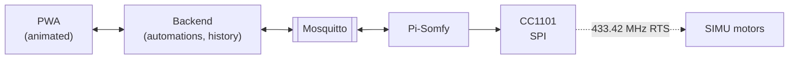

# somfy-shutters


# 🚧 WORK IN PROGRESS 🚧

> **There is no application code in this repository.** Nothing here runs, nothing here
> controls a shutter. What exists so far is the design work: the project constitution,
> a throwaway UI mock you can open in a browser, and the spec-driven scaffolding.
>
> Do not clone this expecting a working system. Everything below describes what is
> being built, not what is finished.

---

Self-hosted control for SIMU/Somfy RTS roller shutters through
[Pi-Somfy](https://github.com/Nickduino/Pi-Somfy): a live animated view of where every
shutter stands, and automations that run on the house's own network.

## The problem this project takes seriously

Somfy RTS is **one-way radio**. The motor has no transmitter: it never reports its
position, never acknowledges a command, and cannot be queried. The only certain
positions are the two mechanical end stops, because the motor physically stops there.

Everything in between is dead reckoning — a known start, a sent command, and elapsed
time. So this app does not pretend to read the shutter. It shows how confident it is:

| State | Meaning |
|---|---|
| **sicher** | just reached an end stop — the only thing the system actually knows |
| **geschätzt** | computed from travel time, shown with the age of the last sync |
| **unsicher** | stale or lost after a restart; dimmed, with a resync offered |

A shutter graphic that silently lies is worse than none, because people act on it.

## Architecture



Pi-Somfy stays the only process that holds rolling-code counters and transmits. This
project never touches the radio — it publishes to `somfy/<address>/level/cmd` and
subscribes to `somfy/<address>/level/set_state`, nothing else. That keeps the
transmitter swappable: moving to ESPSomfy-RTS would change an endpoint, not the app.

| Layer | Choice |
|---|---|
| Radio bridge | Pi-Somfy with CC1101 (E07-M1101D-SMA) over SPI |
| Message bus | Mosquitto |
| Backend | Python + FastAPI (REST + WebSocket) |
| Scheduling | APScheduler for clock triggers, `astral` for sun triggers, offline |
| Storage | SQLite |
| Frontend | Web app installable as a PWA |

Backend, broker and Pi-Somfy all run on the same Raspberry Pi. No extra hardware, no
container orchestrator, no database server.

## Non-negotiables

From [the constitution](.specify/memory/constitution.md), which planning is checked
against:

- **Pi-Somfy owns the radio.** A second transmitter desynchronizes the rolling codes and
  forces physical re-pairing at every window.
- **MQTT is the only integration point.** Pi-Somfy's web UI is not an API.
- **Positions are estimates, not feedback**, and the interface has to say so.
- **Offline by default.** No cloud service between a tap and a shutter moving.
- **Measured physical values** — travel times, addresses, direction — live in
  configuration, never in code.

## The mock

[`mocks/rolladen-ui.html`](mocks/rolladen-ui.html) opens in any browser, no build step.
Four screens on one shared model, in German: overview, detail, automations, and
calibration. Each shutter carries a hidden "truth" — soft start plus a non-linear run —
that the app only learns by measuring, so the difference between a guessed travel time
and a calibrated one is visible by clicking around.

It is **deliberately throwaway**. The real frontend gets built in the chosen stack
against a simulator; this file exists to settle the visual language and the calibration
flow, and gets deleted once that exists.

### Calibration

Travel times cannot be read off the motor, so the user is the sensor: two button presses
per trip, one when the shutter starts moving, one when it arrives. Runs alternate
direction, so every trip starts from an end stop and none is wasted. The median over
three runs per direction lands within about a percentage point of what perfect presses
would give; further presses buy almost nothing (measured in the mock's explainer).
After that, every uninterrupted end-stop-to-end-stop trip in daily use re-measures for
free.

## Development

Work is spec-driven with [GitHub Spec Kit](https://github.com/github/spec-kit):

```
/speckit-constitution → /speckit-specify → /speckit-plan → /speckit-tasks → /speckit-implement
```

Feature code is not written before its spec exists. See [CLAUDE.md](CLAUDE.md) for the
conventions and the repository layout.

## Open hardware questions

Blocking — each has to be measured on real hardware before a feature depends on it:

1. Direction of `level/cmd`: is 0 fully open or fully closed?
2. Per-window travel times, up and down separately.
3. Radio range to the furthest window, antenna attached.
4. Whether CC1101 receive mode gets enabled, which tracks physical remotes.
5. Rolling-code pairing per window, addresses recorded in `operateShutters.conf`.

**The CC1101 runs on 3.3V only** (Pi pin 1 or 17). 5V destroys the module.

## Credits

- [Pi-Somfy](https://github.com/Nickduino/Pi-Somfy) — the RTS bridge this builds on, and
  the source for how shutters are added, paired and removed.
- [Spec Kit](https://github.com/github/spec-kit) — the spec-driven workflow.

Not affiliated with Somfy or SIMU. "Somfy", "SIMU" and "RTS" belong to their owners.

## License

[MIT](LICENSE).
